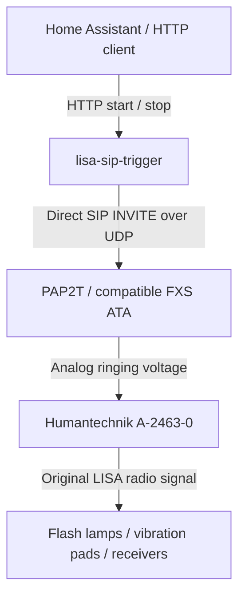

# lisa-sip-trigger

Bridge HTTP/Home Assistant events to legacy Humantechnik LISA receivers using
an A-2463-0 telephone transmitter and a SIP FXS adapter — no soldering and no
RF reverse engineering required.

Reuse the analog telephone input that the A-2463-0 was designed for. A SIP ATA
(analog telephone adapter) generates ringing voltage on its FXS telephone port.
This small Python service controls that ringing over the LAN; the transmitter
then sends its original LISA radio signal to existing receivers. No PBX or SIP
provider account is needed in the tested setup. There are no Python package
dependencies.

## How it works



Plain-text equivalent:

```text
Home Assistant / HTTP client
  -> lisa-sip-trigger
  -> direct SIP INVITE over UDP
  -> PAP2T PHONE 2 analog ringing
  -> A-2463-0 telephone transmitter
  -> original LISA RF
  -> LISA receivers
```

START launches a background loop. Each cycle sends an INVITE, waits for
`180 Ringing`, rings for two seconds by default, and sends CANCEL.
`183 Session Progress` and other provisional responses do not confirm ringing;
the service keeps waiting for `180`. If no `180` arrives before the setup timeout,
the attempt fails and the service sends CANCEL if it received a provisional response.
The normal completion is `200 OK` for CANCEL, `487 Request Terminated` for
INVITE, and an ACK for that INVITE response. The next cycle starts 32 seconds
after the previous cycle started. Failed attempts retry after five seconds.

STOP interrupts ringing, retrigger waits, and retry delays and prevents future
cycles. It is idempotent. **A LISA event already transmitted cannot be recalled:**
a vibration pad or lamp may finish its existing cycle after STOP.

## Tested hardware and configuration

Confirmed by the original hardware deployment:

- Humantechnik **A-2463-0** telephone transmitter.
- Linksys/Cisco **PAP2T**, Line 2 as an unregistered local SIP endpoint.
- A-2463-0 connected to **PHONE 2**.

SPA112-class and other ATAs are **likely compatible, but untested**, if they have
a standard analog FXS port and accept direct, unregistered SIP calls. An Ethernet
port or an FXO telephone input alone does not provide the required FXS ringing.

On the PAP2T's Line 2 page, use these tested settings:

| Setting | Value |
| --- | --- |
| Line Enable | `yes` |
| SIP Port | A separate Line 2 port, e.g. `5061` |
| Register | `no` |
| Ans Call Without Reg | `yes` |
| Restrict Source IP | `no` for initial testing |
| Auth INVITE | `no` for initial testing |
| User ID | `lisa` |

The example target is `sip:lisa@192.0.2.10:5061`. `192.0.2.10` is a documentation
address: replace it with your ATA's LAN address. Match the configured user and
port. No SIP provider credentials are required. Restrict access to trusted hosts
using your LAN firewall; this service does not implement SIP digest authentication.

## Docker quick start

Use a native Linux Docker host on the ATA's LAN with Docker Compose installed.
The default Compose file pulls a **prebuilt Docker Hub image**; no local build,
compiler, or Buildx setup is needed by users.

Image: [`pannal/lisa-sip-trigger`](https://hub.docker.com/r/pannal/lisa-sip-trigger).
Use `latest` or pin a released version such as `0.1.1`.

```bash
cp .env.example .env
# Edit .env: set ATA_HOST to your ATA and optionally set API_TOKEN.
docker compose up -d
```

Example settings (replace the documentation ATA address):

```dotenv
LISA_IMAGE=pannal/lisa-sip-trigger:latest
ATA_HOST=192.0.2.10
ATA_PORT=5061
ATA_USER=lisa
```

The HTTP listener defaults to `0.0.0.0:18080`. Compose deliberately uses
`network_mode: host`: the SIP source socket and Via address use the host's LAN
interface, avoiding Docker NAT complications. The tested deployment uses native
Linux; Docker Desktop/other networking arrangements have not been validated.
Do not add a `ports:` mapping to this host-network configuration.

```bash
docker compose logs -f lisa-sip-trigger
docker compose ps
docker compose stop
```

SIGTERM and SIGINT stop new alarms and wait for active SIP cleanup. Compose allows
15 seconds before forced termination. With a responsive ATA, STOP sends CANCEL
within roughly one receive-poll interval (up to 200 ms). If STOP arrives before
any provisional SIP response, the service listens for that response for the
remainder of the five-second setup window, then cancels when possible. CANCEL
cleanup waits up to three seconds. Network loss, forced kills, or an unresponsive
ATA can prevent confirmed cleanup; STOP cannot undo a radio event already sent.

## Configuration

All service configuration comes from environment variables. Python itself does
not load `.env`; Compose reads it and passes the service settings.

| Variable | Default | Meaning |
| --- | --- | --- |
| `LISA_IMAGE` | Required by Compose | Published Docker Hub image and tag; packaging only |
| `ATA_HOST` | Required | ATA IPv4 address or IPv4-resolvable hostname |
| `ATA_PORT` | `5061` | Direct SIP UDP port |
| `ATA_USER` | `lisa` | SIP user / PAP2T User ID |
| `RING_SECONDS` | `2` | Duration after ringing response before cancellation |
| `RETRIGGER_INTERVAL` | `32` | Minimum cycle start-to-start interval; greater than ring duration |
| `MAX_ALARM_SECONDS` | `1800` | Failsafe stops a run after 30 minutes; `0` disables it |
| `ERROR_RETRY_SECONDS` | `5` | Delay after a failed attempt |
| `HTTP_BIND` | `0.0.0.0` | IPv4 listener address; use loopback for local access only |
| `HTTP_PORT` | `18080` | HTTP port |
| `API_TOKEN` | Empty | Optional token protecting every route except `/health` |
| `LOG_LEVEL` | `INFO` | Set `DEBUG` for SIP response summaries |

Legacy `SPA_HOST`, `SPA_PORT`, and `SPA_USER` environment variables remain supported.
The corresponding `ATA_*` variable takes precedence when present, even if empty
(an empty host/user fails validation). Existing `spa_*` fields in `/status` are
retained alongside `ata_*` fields. Existing deployments using port 8080 must set
`HTTP_PORT=8080` explicitly or update their callers to 18080.

Durations must be finite; ring duration and retry delay must be positive, and the
maximum alarm duration cannot be negative. START while active does **not** reset
the failsafe. Once it expires, a new explicit START is required.

### Empirical LISA timing

In the tested A-2463-0 setup, one approximately two-second analog ring was enough
to trigger a telephone event. The vibration receiver remained active for about
28 seconds. Separate calls at 23, 25, and 27 second intervals did not retrigger;
a 32 second interval worked reliably. **These are empirical observations on one
setup, not official Humantechnik specifications.** Test your own receivers and
adjust `RETRIGGER_INTERVAL` if needed.

## HTTP API

Requests have no required body. Responses are JSON.

| Endpoint | Response |
| --- | --- |
| `POST /alarm/start` | `202` / `started`; `200` / `already_active`; `409` while stopping or shutting down |
| `POST /alarm/stop` | `200` / `stopping` or `already_stopped`; cleanup proceeds in the background |
| `GET /status` | `200` with active/stopping flags, run ID, timestamps, cycle count, last error, and configuration |
| `GET /health` | `200` with `{"ok": true}`; always unauthenticated |

```bash
curl -X POST http://HOST:18080/alarm/start
curl -X POST http://HOST:18080/alarm/stop
curl http://HOST:18080/status
curl http://HOST:18080/health
```

Replace `HOST` with the service host. Repeated START does not launch another loop;
repeated STOP does not start any work. If START returns `409`, wait until
`stopping` becomes false before trying again.

When `API_TOKEN` is configured, use either header style on protected endpoints:

```bash
curl -H "Authorization: Bearer TOKEN" -X POST http://HOST:18080/alarm/start
curl -H "X-API-Key: TOKEN" -X POST http://HOST:18080/alarm/stop
curl -H "X-API-Key: TOKEN" http://HOST:18080/status
```

Missing/incorrect tokens return `401`. The token is never included in status.
`cycles_sent` counts attempted cycles, including failed ones. A successful SIP
cycle and `/health` do **not** establish that a LISA receiver activated. Health
only confirms the HTTP process can respond; it does not ring or probe the ATA.

## Home Assistant

See [examples/home-assistant.yaml](examples/home-assistant.yaml) for REST commands
and a state synchronization automation. Replace the service hostname and generic
`binary_sensor.alarm_active` entity. Map active state to `on` and inactive or
acknowledged state to `off`.

The automation sends START for `on`, STOP for `off`, and resynchronizes the current
state when Home Assistant starts. It queues actions to preserve ordering, and
does not interpret `unknown`/`unavailable` as acknowledgement. If using a token,
uncomment both header sections and store it as `lisa_trigger_api_token` in Home
Assistant's `secrets.yaml`. Home Assistant does not automatically resynchronize
when only this service restarts; manually resynchronize or add a suitable trigger
if your setup requires that. See the official
[REST command](https://www.home-assistant.io/integrations/rest_command/) and
[automation trigger](https://www.home-assistant.io/docs/automation/trigger/) docs.

## Troubleshooting

| Symptom | Check |
| --- | --- |
| No SIP response / setup timeout | Verify `ATA_HOST`, network reachability, UDP firewall rules, and the actual Line 2 `SIP Port`. ICMP ping alone does not prove SIP works. |
| No `180 Ringing` (even if `183` arrives) | Confirm Line Enable=`yes`, Register=`no`, Ans Call Without Reg=`yes`, User ID matches, and the A-2463-0 is on PHONE 2. |
| ATA ignores INVITE | Check `Restrict Source IP` and `Auth INVITE`; use the initial test settings above on a trusted LAN. |
| ATA returns `4xx` / `5xx` | Read the status code in logs and `last_error`; check user, authentication restrictions, busy line, and ATA configuration. Rejected INVITEs are acknowledged and retried after the error delay. |
| Works outside Docker only | Use native Linux host networking; check host firewall rules and the source/Via address in DEBUG logs. Bridged Docker NAT is not the tested path. |
| Unexpectedly answered INVITE | The service sends ACK + BYE; check for auto-answer or another telephone on the FXS port. This project generates ringing, not audio calls. |
| No final INVITE response after CANCEL | Packet loss or ATA transaction handling prevented confirmed cleanup. Inspect LAN traffic and ATA configuration. A `200` for CANCEL alone does not prove INVITE finished. |
| A-2463-0 triggers once only | Allow its cooldown. Keep the empirical 32-second interval initially; shorter intervals failed in the tested setup. |
| Receiver continues after STOP | Already transmitted LISA cycles cannot be recalled. STOP cancels analog ringing and prevents future attempts. |
| API returns `401` | Check `.env` token, header spelling, and Home Assistant secret. Recreate the container after configuration changes. |
| Container exits/restarts | Read startup logs for missing host, malformed port, invalid durations, or an occupied HTTP port. |
| Container is unhealthy | Inspect health output with `docker inspect lisa-sip-trigger`; check `HTTP_BIND`, `HTTP_PORT`, and `/health` from the host. The image's health check uses the configured bind/port and needs no token. |
| Image pull fails | Confirm the selected tag exists under `pannal/lisa-sip-trigger` and check registry connectivity. |

## Security and limitations

Run only on a trusted LAN. **Do not expose the HTTP or SIP ports directly to the
public Internet.** Anyone who can reach an unauthenticated service can trigger or
stop an alarm. Configure `API_TOKEN` and firewall access to intended clients;
tokens travel over plain HTTP, so they do not provide transport encryption.

The container runs without root, with a read-only filesystem and no Linux
capabilities in the supplied Compose configuration. Keep `.env` and real tokens
out of Git; `.env.example` contains no credentials.

This is a small direct IPv4/UDP SIP client for ringing one ATA endpoint. It has
bounded retries and cleanup windows, not a complete general-purpose SIP stack.
Unexpected-answer ACK/BYE cleanup is best effort and does not wait for BYE
confirmation. Repeated final responses after the socket closes are not handled.
It does not implement registration, provider authentication, proxy routing,
TLS/SRTP, RTP audio, or receiver feedback. No alarm state survives process restart.
No software check can prove that the transmitter, radio link, or receiver worked.

## Development and verification

Python 3.12+ is supported; CI tests Python 3.12, 3.13 and 3.14. The container uses
`python:3.13-alpine`. Only the standard library is needed:

```bash
python3 -m unittest discover -s tests -v
ATA_HOST=192.0.2.10 python3 server.py
```

Tests use loopback UDP and HTTP sockets and require permission to create local
sockets. They cover normal SIP cancellation and identifiers, rejection ACKs,
timeouts/retransmission, early STOP, unexpected answers, HTTP authentication and
idempotency, concurrent START, error recovery, failsafe interruption, and SIGTERM
while ringing. They never need a real ATA or send a LISA event.

For an explicit local build:

```bash
docker build --target test -t lisa-sip-trigger:test .
docker build -t lisa-sip-trigger:local .
LISA_IMAGE=lisa-sip-trigger:local docker compose up -d
```

With a configured Buildx builder and QEMU or native builders, verify both targets:

```bash
docker buildx build --platform linux/amd64,linux/arm64 --target test .
docker buildx build --platform linux/amd64,linux/arm64 --target runtime .
```

## Container releases (maintainers)

Source repository: [pannal/lisa-sip-trigger](https://github.com/pannal/lisa-sip-trigger).

Primary image: **`pannal/lisa-sip-trigger`** on Docker Hub. The workflow
builds for `linux/amd64` and `linux/arm64`, using Buildx and GitHub Actions layer
caching. It runs the tests inside each architecture's Python container as well as
on Python 3.12, 3.13 and 3.14 on the runner. Actual hardware compatibility is separate
from CPU architecture support.

Before publishing:

1. Use the public Docker Hub repository `pannal/lisa-sip-trigger`.
2. To publish a fork elsewhere, set the GitHub repository variable `DOCKERHUB_IMAGE`
   to its `namespace/repository` (no tag or registry prefix).
3. For automatic CI publication, set repository secrets `DOCKERHUB_USERNAME` and
   `DOCKERHUB_TOKEN`; the token must
   have permission to push that image. The username may differ from an organization
   namespace. Alternatively, leave these secrets unset and publish the built OCI
   archive with a locally authenticated registry client. The tag workflow still
   runs tests and builds both architectures, then exports the release archive.
   Missing credentials produce a workflow warning; the run summary explicitly
   states that the Docker Hub image was not published and points to the archive.
4. If changing the image name, update `.env.example` and this README too.
   Compose reads `LISA_IMAGE` from `.env`.
5. Review changes, local tests/builds, and the hardware cancellation behavior.
   Obtain explicit approval before any push, release, or image publication.
6. After approval, push a stable `vX.Y.Z` Git tag to trigger the release workflow.

Pull requests and branch pushes run tests and build containers, with **no registry
login or publishing**. They also retain a multi-platform OCI image archive for
14 days as the `lisa-sip-trigger-oci` Actions artifact. Download it from the run's
Artifacts section or with the GitHub CLI; no local Docker installation is needed
to obtain the built image:

```bash
gh run download RUN_ID --repo pannal/lisa-sip-trigger --name lisa-sip-trigger-oci
```

With CI credentials configured, stable release tags publish the major, minor, full version,
`latest`, and `sha-<shortsha>` tags. For example, `v1.2.3` publishes `1`, `1.2`,
`1.2.3`, `latest`, and a SHA tag. Prerelease/malformed tags are rejected. There is
no automatic edge publication or second registry. Publishing an older version
also updates `latest`; release only the intended current stable version through
this workflow. Use protected tags to control who can trigger publication.

To pin this release, set `LISA_IMAGE=pannal/lisa-sip-trigger:0.1.1` in `.env`
instead of `latest`. Version tags are conventional tags, not enforced immutable
references; pin an image digest when exact content identity is required.

The Dockerfile supplies title, description, and MIT license labels. Release
metadata adds the GitHub source URL, revision, and version via Docker's
[metadata action](https://github.com/docker/metadata-action). See also Docker's
[multi-platform Actions documentation](https://docs.docker.com/build/ci/github-actions/multi-platform/).

## License and disclaimer

[MIT License](LICENSE).

This is an unofficial project, not affiliated with Humantechnik or Cisco/Linksys.
It is **not a certified alarm, safety, or medical device**. Use it only as an
additional notification path, never as a replacement for any primary safety,
medical, or alarm system. Hardware names and trademarks belong to their owners.
